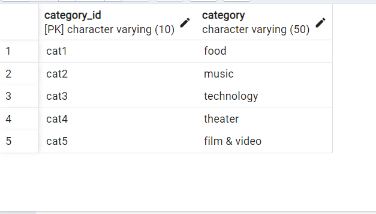

# Crowd_funding_ETL
project2

# Collaborators : Nasir Qadri and Mehr Atif

# OBJECTIVE:

For the ETL (Extract, Transform and Load) mini project, we have worked with a partner to practice building an ETL pipeline using Python, Pandas, and  Python dictionary methods  to extract and transform the data. After we transformed the data, we  created four CSV files and used the CSV file data to create an ERD and a table schema. Finally, we uploaded the CSV file data into a Postgres database.

# File Locations:

Please check the starter_files folder for all the data.
Please check the Resources folder for all the csv files.
Please check the SQL_output folder for all the sql output images.

[Link to Notebook](/Starter_Files/ETL_Mini_Project_NQadri_MAtif.ipynb)

# Conclusion:

Working on the ETL mini project has been a valuable experience, providing hands-on exposure to the entire Extract, Transform, and Load process. We took our raw data from the csv files and leveraging pandas dictionary and looping techniques with list comprehension  we cleared out  unnecessary information and created insightful dataframes/tables.  We created a full ETL pipeline which includes visualizations for easier understanding..It gave us the confidence that we are ready to work in the industry with such sort of projects.

